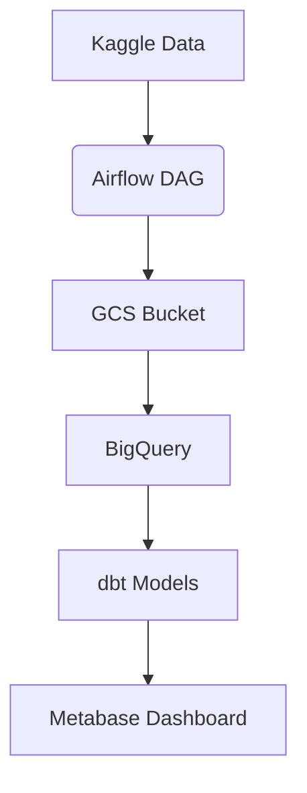

# 🌦️ Berlin Weather Data Engineering Pipeline

**An end-to-end data engineering pipeline** collecting, processing, and analyzing Berlin's hourly weather data.


## 📌 Project Overview
This project automates:
1. Data ingestion from Kaggle
2. Cloud storage (GCS)
3. Data warehousing (BigQuery)
4. Transformation (dbt)
5. Visualization (Metabase)

## 🛠️ Tech Stack
| Component        | Technology           |
|------------------|----------------------|
| Infrastructure   | Terraform (GCP)      |
| Orchestration    | Apache Airflow       |
| Storage          | Google Cloud Storage |
| Data Warehouse   | BigQuery             |
| Transformation   | dbt                  |
| Visualization    | Metabase             |
| Containerization | Docker               |

## 📂 Data Source
[Berlin Hourly Weather Data](https://www.kaggle.com/datasets/mexwell/berlin-hourly-weather-data) from Kaggle

## 🚀 Quick Start

### 1. Infrastructure Setup
```bash
terraform init
terraform apply  # Creates GCS bucket and BigQuery dataset
```

### 2. Run Airflow
```bash
docker-compose up
```
Access Airflow UI at: http://localhost:8080

### 3. Data Transformation
```bash
cd dbt_project
dbt run
```

### 4. Visualization
```bash
docker run -d -p 3000:3000 --name metabase metabase/metabase
```

Access Metabase at: http://localhost:3000

## Example images


## 📊 Pipeline Architecture


## 🔧 Troubleshooting

    Airflow DAG errors: Verify GOOGLE_APPLICATION_CREDENTIALS are set

    BigQuery permissions: Ensure service account has proper roles

    Kaggle API: Check ~/.kaggle/kaggle.json exists

## 📅 Future Improvements

    Add real-time data streaming

    Implement ML forecasting models

    Optimize pipeline scheduling


## all steps I took

1. Create the repository (Git):
    - `git init`
    - `git remote add origin https://github.com/batxes/Berlin-Weather-Project.git`
    - `git branch -M main`

2. Python virtual environment (Pipenv):
    - Create requirements.txt, add some libraries (we will update this on the go)
    - `pipenv install -r requirements.txt`
    - `pipenv shell`

3. Infrastructure as Code (IaC) (Terraform):
    Here we will define and provision cloud resources. It is imporatnt for automation of infrastructure setup, reproducibility and scalability.
    - Install Terraform: https://developer.hashicorp.com/terraform/install?product_intent=terraform
    - Add google as provider and a GS bucket and Bigquery as resources
    - Add also a variables.tf so main.tf can be cleaner.
    - Now, We want to set up terraform in GCP. For that we need a service account. Go to Google Cloud and do the next steps:
        - Create a new project. Note the project ID into the variables 
        - Go to IAM and ADmin -> Service accounts -> Create service account (berlin-weather-service-account) -> Add roles (storage admin, bigquery admin, Compute ADmin). If in the future we want more roles or edit them, we can do that in IAM->edit-> roles
        - Create a new key (json) and save it in the computer. Edit the gitignore
        - terraform init. If sucessful it will create .terraform folder and .terraform.lock
        - I also added the .files from terraform to the gitignore, just in case
        - Now create a bucket. berlin-weather-bucket. Add to the main.tf as resource.
        - terraform plan -> terraform apply.
        - previous command gave error: Error: googleapi: Error 409: Your previous request to create the named bucket succeeded and you already own it., conflict 
        -  to fix, I used import: terraform import google_storage_bucket.data_lake berlin-weather-bucket
        - This happened because I created the bucket from the GCP web. With terraform, it could have been created directly. I will do this now for the bigquery dataset.
        - lets destroy what we have: terraform destroy. See that the bucket dissapears from the google cloud Platform.
        - adter adding the bigquery as resource, terraform plan, apply and check that it appears in GCP
        
4. Data Ingestion and Orchestration (Airflow/Prefect): Now we want to create a workflow (direct acyclic graph (DAG)) to ingest data (APIs, databases), upload to a data lake (GCS, S3) and load the data into the warehouse (Bigquery, Redshift). It is important to automate data ingestion and loading, reliability and scalability.
    - export AIRFLOW_HOME=~/work/Berlin-Weather-Project  NOTE: add this to bashrc
    - `pip install apache-airflow` -> add also to requirements
    - `airflow db init`
    - `airflow users create --username admin --firstname Ibai --lastname Irastorza --role Admin --email batxes@gmail.com`
    -  add password (ninja)
    - `airflow webserver --port 8080` -> if this fails: pip install --upgrade apache-airflow
    - `airflow scheduler`
    - Access the Airflow UI at http://localhost:8080
    
    4.1  Now that we have airflow up and running, lets create a DAG for Data Ingestion

    - Create data_ingestion_dag.py in the dags/ directory
    - add google.cloud to requirements.txt. Install it before with pip install google.cloud
    - install and add also pip install --upgrade google-cloud-storage
    - Get the KAggle API. Put the json in ~/.kaggle and then I create a variables.py file where I pasted the username and key
    - add the variables.py to gitignore, we dont want our key there.
    - pip install kaggle
    - to check the name of the datasets: ╰─❯ kaggle datasets list -s berlin                                                                                
    - Note: if the dag fails because of GCP credentials, this worked: export GOOGLE_APPLICATION_CREDENTIALS="/home/ibai/work/Berlin-Weather-Project/keys/berlin-weather-project-25fec91b5442.json"
    - Note: Maybe we need to specify these exports beforehand
    - Note2: ẁhen running the dags, it says kaggle can not be imported. I added a dockerfile which install kaggle, and added "build ." command to 
    - Added 2 more dags, to create a table and to load into bigquery
    - I need to install this also: pip install apache-airflow-providers-google  -> add to requirements.txt   
    - I added the OS.environ GCS credentials to the beginning of the code, because each task needs them

    - Final step: I created a docker-compose with airflow so I can run it and forget about all steps in point 4. I downloaded the docker compose code from the official website. I added some variables so it can read my environment variables. Added also kaggle to requirements.
    - username and pass: airflow, airflow
    - Notes: if airlfow says to upgrade database:
        - docker-compose run --rm airflow-cli bash
        - 

5. Data transformation (dbt)
    - First install dbt-bigquery
    - set up a dbt project: 
        - create a directory: mkdir dbt_project -> cd dbt_project
        - initialize: dbt init (I called the project berlin_weather)
    - configure profiles.yml file to connect to BigQuery
    - create a transformation model: example_model.sql
    - cd berlin_weather -> dbt run

    At this point, we should have in ~/.dbt/profiles.yml and also inside dbt_project the dbt project with the dbt_project yml and the exampple.sql in models. wITH RUN, we get a view in bigquery.

6. Data Visualization Dashboard (metabase / google looker studio)
    - For Metabase (offline):
        - docker run -d -p 3000:3000 --name metabase metabase/metabase
        - run http://localhost:3000/
    - For google looker studio (cloud):
        - create a new report
        - connect to BigQuery dataset
    

